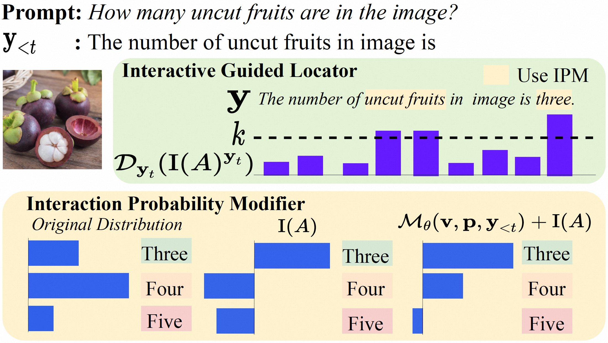

# INTER: Mitigating Hallucination in Large Vision-Language Models by Interaction Guidance Sampling [[Paper](https://arxiv.org/abs/2507.05056)]


## Overview

<p align="center">
    </a> <br>
</p>


<b>Abstract:</b> Hallucinations in large vision-language models (LVLMs) pose significant challenges for real-world applications, as LVLMs may generate responses that appear plausible yet remain inconsistent with the associated visual content. This issue rarely occurs in human cognition. We argue that this discrepancy arises from humans' ability to effectively leverage multimodal interaction information in data samples. Specifically, humans typically first gather multimodal information, analyze the interactions across modalities for understanding, and then express their understanding through language. Motivated by this observation, we conduct extensive experiments on popular LVLMs and obtained insights that surprisingly reveal human-like, though less pronounced, cognitive behavior of LVLMs on multimodal samples. Building on these findings, we further propose INTER: Interaction Guidance Sampling, a novel training-free algorithm that mitigate hallucinations without requiring additional data. Specifically, INTER explicitly guides LVLMs to effectively reapply their understanding of multimodal interaction information when generating responses, thereby reducing potential hallucinations. On six benchmarks including VQA and image captioning tasks, INTER achieves an average improvement of up to 3.4% on five LVLMs compared to the state-of-the-art decoding strategy. 


## Preparation
```
conda create -yn inter python=3.10
conda activate inter
cd inter
pip install -r requirements.txt
```

## Inference
After setup the environment, you can directly use our code to every LVLM. Here, using InstructBLIP as an example, we explain how to use it:
1. Prepare input of INTER
```
inputs_just_q = processor(images=raw_image, text="", return_tensors="pt").to(device)
image_rand = torch.rand_like(image_cd, device = image_ori.device)
```

2. Change forward function in modeling_instructblip.py
```
outputs,to_save = self.language_model.generate(
    inputs_embeds={"nomask":inputs_embeds, 'maskimage_shapley': inputs_embeds_mask_image_shapley,'masktext': inputs_embeds_mask_text, 'maskall': inputs_embeds_mask_all},
    attention_mask=attention_mask,
    **generate_kwargs,
)
```
Note: The parameters of forward function need to be modified to pass different inputs into the sampling process for models.

3. Modifying the generate Function in Transformers
```
from generate import change_generate
change_generate()
```

4. Use INTER
```
from shapley import evolve_ours_sampling
evolve_ours_sampling()
```


## Examples

<p align="center">
    </a> <br>
</p>
<p align="center">
    </a> <br>
</p>
<p align="center">
    </a> <br>
</p>


